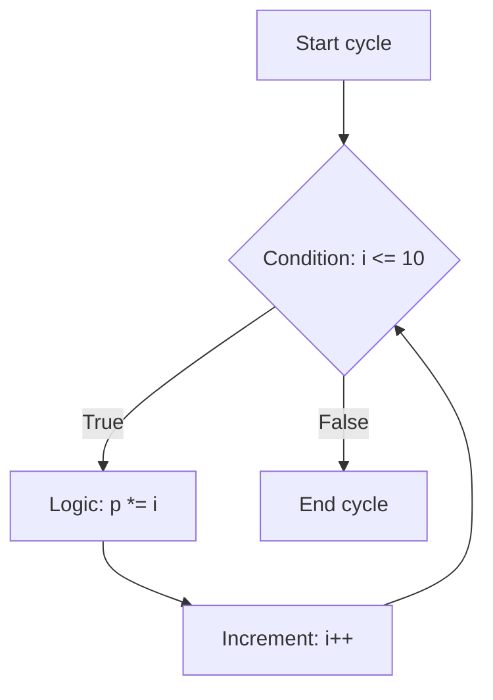

# First C++ project

Basic for loop program in C++. Task is to create program that prints numbers from 1 to 10 using a for loop `while`.

But code was problem, this problem is commented variable `i`, this variable is used in the for loop incremet and to satisfy in while condition `i <= 10`

```c++
while (i <= 10)
{
	p *= i;
	// i++; this line isn't working because variable `i` is commented out
};
```

Visually, the flow of the program (`while` loop) can be represented as follows:

```mermaid
flowchart TD# First C++ Project

A basic program demonstrating the **while loop** in C++. The task is to create a program that prints/calculates numbers from 1 to 10 using a `while` loop.

### The Problem
Initially, the code had a bug: the increment of the variable `i` was commented out. Because of this, the condition `i <= 10` always remained true, resulting in an **infinite loop**.

```cpp
while (i <= 10)
{
    p *= i;
    // i++; <--- This line was commented out, causing the infinite loop
}
```

### Visual Workflow
When fixed, the correct execution flow of the `while` loop looks like this:



### The Solution
To fix the issue and prevent the infinite loop, you simply need to uncomment the `i++;` line. This ensures that the loop variable increments on each iteration and eventually satisfies the exit condition.

    A[Start cycle] --> C(condition i <= 10)
    C -->|True| D[Logic: p*i]
    D --> F[Increment: i++]
    F --> C
    C -->|False| E[End cycle]
```

So, cyclicality has formed, because the variable `i` is commented out, and the loop will never terminate. To fix this issue, you need to uncomment the variable `i`.