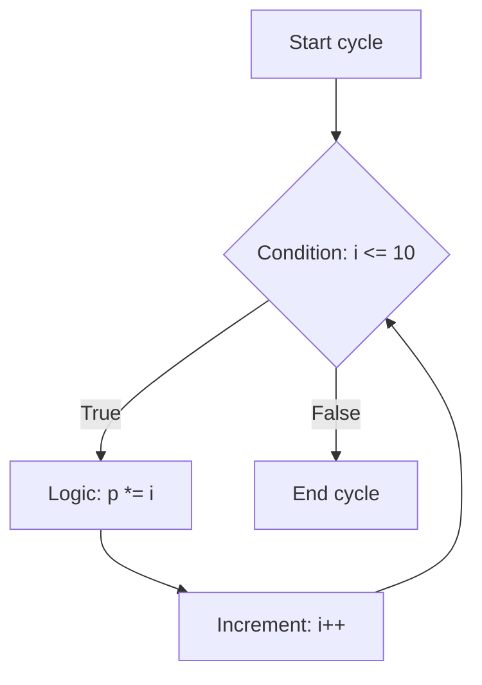

# First C++ Project

A basic program demonstrating the **while loop** in C++. The task is to create a program that calculates the product of numbers from 1 to 10 using a `while` loop.

### The Problem
Initially, the code had a bug: the increment of the variable `i` was commented out. Because of this, the condition `i <= 10` always remained true, resulting in an **infinite loop**.

```cpp
while (i <= 10)
{
    p *= i;
    // i++; <--- This line was commented out, causing the infinite loop
}
```

An infinite loop is formed because the variable `i` is commented out, meaning the cycle will never reach its termination condition.

### Visual Workflow
When fixed, the correct execution flow of the `while` loop looks like this:



### The Solution
To fix this issue and prevent the infinite loop, you simply need to uncomment the `i++;` line. This ensures that the loop variable increments on each iteration and eventually satisfies the exit condition.

```cpp
while (i <= 10)
{
    p *= i;
    i++; // <--- Uncommented line ensures the loop terminates
}
```
