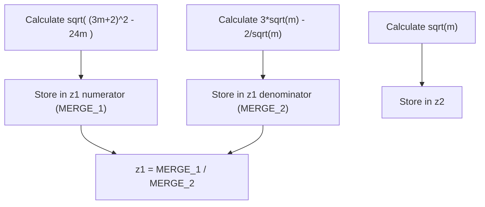

# Math Calculation Project (Variant 17)

A basic C++ program demonstrating input validation, structure usage, and mathematical calculations using the `<cmath>` library. The program implements the formulas from **Variant 17**.

### The Task

Create a program that accepts a positive number `m` from the user and calculates the results for two mathematical expressions, $z_1$ and $z_2$, as specified in Variant 17.

### Visualizing the Formulas

These are the exact formulas from Variant 17 that the code must implement:

$$z_1 = \frac{\sqrt{(3m+2)^2 - 24m}}{3\sqrt{m} - \frac{2}{\sqrt{m}}}$$

$$z_2 = \sqrt{m}$$

*(The goal of the calculation is usually to demonstrate that $z_1 = z_2$ for $m > 0$.)*

### Input Handling Logic

The program requires $m$ to be greater than 0, as $\sqrt{m}$ and division by zero are undefined for non-positive numbers. The code uses a `while` loop to ensure a correct value is entered.

#### Validation Structure (in main.cpp)

```cpp
// Look in main.cpp
bool isLoop = true;
while (isLoop) {
    std::cout << "0 - Exit\nWrite number (m): ";
    std::cin >> pr.m;

    if (pr.m == 0) {
        return 0; // Exit program
    } else if (pr.m > 0) {
        isLoop = false; // Input is valid, exit loop
    } else {
        std::cout << "Don't write m < 0\n"; // Input invalid, prompt again
    }
}
```

The cycle continues as long as `m` is less than or equal to 0. A condition of 0 allows the user to terminate the program immediately. Entering a negative value triggers an error message, and the loop requests input again. This ensures that the code will never attempt to calculate `calc(pr)` with an invalid `m`.

### The Mathematical Implementation

The program is split into a header file (`Params.h`) defining the structure, and a implementation file (`functions.cpp`) performing the calculation.

#### Implementation Workflow

The calculation function uses step-by-step intermediate variables (`BLOCK_N`, `MERGE_N`) to translate the complex formula into readable code.



#### Final Output

Upon successful calculation, the program displays the results on the console, confirming that the two expressions produce identical values.

```cpp
// Final part of main.cpp
std::cout << "z1=" << pr.z1 << "\n" << "z2=" << pr.z2 << std::endl;
```